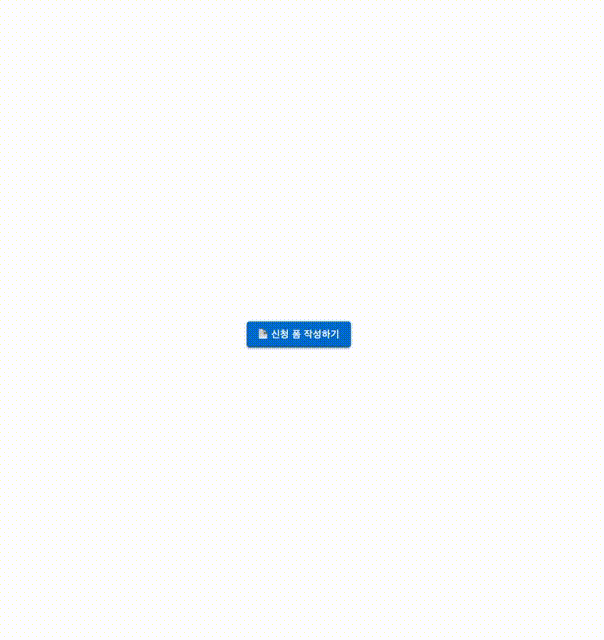

# 접근성 모달 폼
접근성을 지원하는 모달폼 컴포넌트를 구현한 프로젝트입니다.



## 기술 스택
- react 22.12.0
- typescript 5.8.3
- MUI 7.3.2
- zod 4.1.11

## 추가 라이브러리
## MUI
빠른 UI 구성을 위해 사용
### 설치
```shell
npm install @mui/material @emotion/react @emotion/styled
```

## Zod
유효성 검증을 위해 사용
### 설치
```shell
npm install zod
```

## 디렉터리 구조
```shell
.
├── README.md
├── ...
├── src
│   ├── components
│   │   └── mui
│   │       ├── ...
│   │       └── Modal             # 모달 공통 컴포넌트
│   ├── domain
│   │   └── application           # 제출 양식 관련 컴포넌트
│   ├── hooks
│   ├── main.tsx
│   ├── pages
│   │   └── Home
│   │       ├── ModalFormPage.tsx # 모달 페이지
│   │       └── index.tsx
│   ├── types
│   └── utils
```

## 실행 방법
```shell
npm run dev
# or
yarn dev
# or
pnpm dev
```